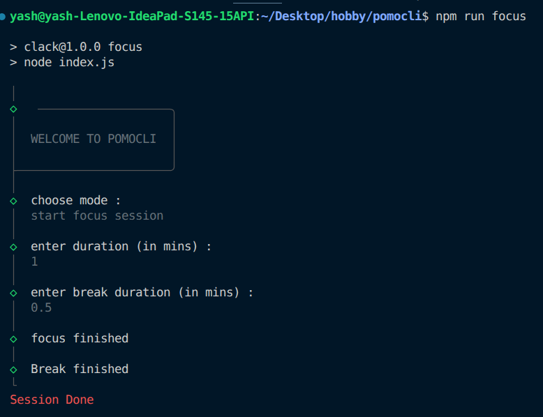

# pomocli
- pomocli is a cli based pomodoro timer application 

# usage
- clone the repo
- npm run focus command to start cli  

# tech use 
- clack.js for modern and sleek cli
- nodejs 

# screenshots

